<!-- generated by hand 2026-05-10 — DO NOT regenerate via gen_indexes.py; this is a curated mermaid org chart -->

# Abzum Org Chart

> The company tree. Every box below is a clickable link to that role's profile. Tier badges (L0/L1/L2/L3/L4/L5) per the [AI-Native 5-Tier Model](../08-strategy/ai_native_5_tier_model.md).

```mermaid
flowchart TD
    Vijay["Vijay Tilak<br/>CEO/Founder<br/>(L0 Human)"]:::human

    Felix["Felix Stanley<br/>CAIO<br/>(L1 AI Exec)"]:::exec
    CDO["CDO<br/>Chief Delivery Officer<br/>(L1 AI Exec — stub)"]:::exec
    CSCO["CSCO<br/>Chief Security & Compliance<br/>(L1 AI Exec — stub)"]:::exec

    Vijay --> Felix
    Vijay --> CDO
    Vijay --> CSCO

    subgraph PLAT["L4 Platform & Orchestration — under Felix CAIO"]
        Orch["Orchestrator"]:::ai
        Watch["Watcher"]:::ai
        Router["Router (stub)"]:::ai
        ProjAlloc["Project Allocator (stub)"]:::ai
        Prov["Provisioning (stub)"]:::ai
        StratMeta["Strategy-Meta (stub)"]:::ai
        MonAudit["Monitoring/Audit (stub)"]:::ai
        CostOpt["Cost-Optimizer (stub)"]:::ai
        ModelR["Model-Routing (stub)"]:::ai
        ComplMeta["Compliance-Meta (stub)"]:::ai
        RBAC["RBAC (stub)"]:::ai
        MemMgr["Memory Manager (stub)"]:::ai
    end

    subgraph DEL["L2 Project Delivery — under CDO"]
        Triage["Triage / Intake"]:::ai
        CEA["Client Engagement Agent"]:::ai
        Planner["Planner"]:::ai
        PM["Project Manager (stub)"]:::ai
    end

    subgraph ENG["L2 Engineering — under CDO via Felix"]
        Arch["Architect"]:::ai
        Senior["Senior Coder"]:::ai
        Junior["Junior Coder"]:::ai
        Tester["Tester"]:::ai
        Sec["Security"]:::ai
        DevOps["DevOps"]:::ai
        Infra["Infrastructure Engineer"]:::ai
    end

    subgraph DES["L2 Design — under CDO"]
        UI["Interface Designer"]:::ai
        Brand["Brand Designer"]:::ai
        Motion["Motion & Video Designer"]:::ai
    end

    subgraph KI["L2 Knowledge & Intelligence — under CDO"]
        Resrch["Researcher"]:::ai
        TechW["Tech Writer"]:::ai
        KGraph["Knowledge Graph (stub)"]:::ai
        SearchR["Search & Retrieval (stub)"]:::ai
        Learn["Learning Agent (stub)"]:::ai
    end

    Felix --> PLAT
    CDO --> DEL
    CDO --> ENG
    CDO --> DES
    CDO --> KI
    CSCO --> Sec
    CSCO --> ComplMeta
    CSCO --> RBAC

    subgraph HD["L3 Human Delivery — trust-critical sign-offs"]
        SolArch["Solution Architect (stub)"]:::human
        DM["Delivery Manager (stub)"]:::human
        PrincEng["Principal Engineer (stub)"]:::human
        SecLead["Security Lead (stub)"]:::human
    end
    Vijay --> HD

    subgraph BO["L5 Business Ops"]
        Fin["Finance & Billing (stub)"]:::ai
        HR["HR & Talent (stub)"]:::ai
        Legal["Legal & Compliance (stub)"]:::ai
    end
    Vijay --> BO

    click Vijay "01-executive/vijay_ceo_founder.md"
    click Felix "01-executive/felix-caio/role.md"
    click CDO "01-executive/cdo_chief_delivery_officer.md"
    click CSCO "01-executive/csco_chief_security_compliance_officer.md"
    click Orch "04-platform-orchestration/01-orchestration/orchestrator.md"
    click Watch "04-platform-orchestration/01-orchestration/watcher.md"
    click Router "04-platform-orchestration/01-orchestration/router.md"
    click ProjAlloc "04-platform-orchestration/01-orchestration/project_allocator.md"
    click Prov "04-platform-orchestration/01-orchestration/provisioning.md"
    click StratMeta "04-platform-orchestration/01-orchestration/strategy_meta.md"
    click MonAudit "04-platform-orchestration/01-orchestration/monitoring_audit.md"
    click CostOpt "04-platform-orchestration/02-cost-and-routing/cost_optimizer.md"
    click ModelR "04-platform-orchestration/02-cost-and-routing/model_routing.md"
    click ComplMeta "04-platform-orchestration/03-governance/compliance_meta.md"
    click RBAC "04-platform-orchestration/03-governance/rbac.md"
    click MemMgr "04-platform-orchestration/03-governance/memory_manager.md"
    click Triage "02-ai-systems/02-project-delivery/triage_intake.md"
    click CEA "02-ai-systems/02-project-delivery/client_engagement_agent.md"
    click Planner "02-ai-systems/02-project-delivery/planner.md"
    click PM "02-ai-systems/02-project-delivery/project_manager.md"
    click Arch "02-ai-systems/01-engineering/architect.md"
    click Senior "02-ai-systems/01-engineering/senior_coder.md"
    click Junior "02-ai-systems/01-engineering/junior_coder.md"
    click Tester "02-ai-systems/01-engineering/tester.md"
    click Sec "02-ai-systems/01-engineering/security.md"
    click DevOps "02-ai-systems/01-engineering/devops.md"
    click Infra "02-ai-systems/01-engineering/infrastructure_engineer.md"
    click UI "02-ai-systems/03-design/interface_designer.md"
    click Brand "02-ai-systems/03-design/brand_designer.md"
    click Motion "02-ai-systems/03-design/motion_designer.md"
    click Resrch "02-ai-systems/04-knowledge-intelligence/researcher.md"
    click TechW "02-ai-systems/04-knowledge-intelligence/tech_writer.md"
    click KGraph "02-ai-systems/04-knowledge-intelligence/knowledge_graph_agent.md"
    click SearchR "02-ai-systems/04-knowledge-intelligence/search_retrieval_agent.md"
    click Learn "02-ai-systems/04-knowledge-intelligence/learning_agent.md"
    click SolArch "03-human-delivery/solution_architect.md"
    click DM "03-human-delivery/delivery_manager.md"
    click PrincEng "03-human-delivery/principal_engineer.md"
    click SecLead "03-human-delivery/security_lead.md"
    click Fin "05-business-ops/finance_billing.md"
    click HR "05-business-ops/hr_talent.md"
    click Legal "05-business-ops/legal_compliance.md"

    classDef human fill:#fff3cd,stroke:#856404,stroke-width:2px,color:#000
    classDef exec fill:#d1ecf1,stroke:#0c5460,stroke-width:2px,color:#000
    classDef ai fill:#d4edda,stroke:#155724,stroke-width:1px,color:#000
```

## Layers

| Layer | Description | Personas |
|---|---|---|
| **L0** Human top | CEO/Founder — vision, partnerships, final approvals | [Vijay Tilak](01-executive/vijay_ceo_founder.md) |
| **L1** AI Exec | 4 AI agents directly under Vijay | [Felix CAIO](01-executive/felix-caio/role.md) · [CDO](01-executive/cdo_chief_delivery_officer.md) · [CSCO](01-executive/csco_chief_security_compliance_officer.md) |
| **L2** AI Systems | The agent-driven org brain — 4 disciplines | Engineering (7) · Project Delivery (4) · Design (3) · Knowledge & Intelligence (5) |
| **L3** Human Delivery | Trust-critical sign-offs only (4 stubs) | [Solution Architect](03-human-delivery/solution_architect.md) · [Delivery Manager](03-human-delivery/delivery_manager.md) · [Principal Engineer](03-human-delivery/principal_engineer.md) · [Security Lead](03-human-delivery/security_lead.md) |
| **L4** Platform & Orchestration | Tier-1 meta-agents (12 under Felix CAIO) | Orchestrator + Watcher + Paperclip-11 |
| **L5** Business Ops | Finance / HR / Legal (3 stubs) | [Finance & Billing](05-business-ops/finance_billing.md) · [HR & Talent](05-business-ops/hr_talent.md) · [Legal & Compliance](05-business-ops/legal_compliance.md) |

## Subdirectories

- [`01-executive/`](01-executive/_index.md) — L0 + L1
- [`02-ai-systems/`](02-ai-systems/_index.md) — L2 (4 disciplines)
- [`03-human-delivery/`](03-human-delivery/_index.md) — L3 humans
- [`04-platform-orchestration/`](04-platform-orchestration/_index.md) — L4 Tier-1 meta-agents
- [`05-business-ops/`](05-business-ops/_index.md) — L5

## Counts (after 2026-05-10 restructure)

| Type | Count | Status |
|---|---|---|
| Humans (L0 + L3) | 5 | Vijay active; 4 L3 stubs |
| AI Execs (L1) | 4 | Felix active; CDO + CSCO stubs |
| AI Systems (L2) | 19 | 15 active personas + 4 K&I stubs |
| Tier-1 Meta (L4) | 12 | Orchestrator + Watcher active; 10 Paperclip-11 stubs |
| Business Ops (L5) | 3 | All stubs |
| **Total** | **43 roles** | **17 fully documented; 26 stubs awaiting Vijay sign-off** |

## Related

- [`08-strategy/ai_native_5_tier_model.md`](../08-strategy/ai_native_5_tier_model.md) — clearance / authority model
- [`08-strategy/two_tier_architecture.md`](../08-strategy/two_tier_architecture.md) — Tier-1 platform vs Tier-2 project agents
- [`08-strategy/agent_orchestration.md`](../08-strategy/agent_orchestration.md) — Paperclip-11 meta-agent details
- [`08-strategy/persona_team_v013.md`](../08-strategy/persona_team_v013.md) — model + tool mappings (BV/BP)
- [`05-process/use_case_team_mapping.md`](../05-process/use_case_team_mapping.md) — UC → persona team
