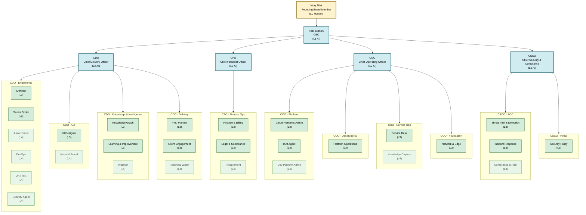

# Abzum Org Chart — AI-Native 5-Tier Model

**30 total roles** | 5 human (L0 + future L3 sign-off) | 25 AI agents | Last updated: 2026-05-13

## Tier Overview

| Tier | Count | Description |
|---|---|---|
| L0 | 1 | Human Board — Vijay Tilak (Founding Board Member) |
| L1 | 1 | AI CEO — Felix Stanley |
| L2 | 4 | AI C-Suite — CDO, CFO, COO, CSCO |
| L3 | 15 | Department Lead AI Agents |
| L4 | 9 | Operational AI Agents |

## Org Structure



## Directory Structure

```
02-org/
├── _index.md                          ← this file
├── 01-board/
│   └── vijay_tilak.md                 ← L0 Founding Board Member
├── 02-executive/
│   ├── felix_stanley_ceo.md           ← L1 CEO
│   ├── cdo_chief_delivery_officer.md  ← L2
│   ├── cfo_chief_financial_officer.md ← L2
│   ├── coo_chief_operating_officer.md ← L2
│   └── csco_chief_security_compliance.md ← L2
├── 03-cdo/
│   ├── 01-engineering/                ← Arch(L3) Senior(L3) Junior(L4) DevOps(L4) QA(L4) SecAgent(L4)
│   ├── 02-ux/                         ← UI(L3) VisualBrand(L4)
│   ├── 03-knowledge/                  ← KGraph(L3) L&I(L3) Watcher(L4)
│   └── 04-delivery/                   ← PM(L3) ClientEngagement(L3) TechWriter(L4)
├── 04-cfo/                            ← Finance(L3) Legal(L3) Procurement(L4)
├── 05-coo/
│   ├── 01-platform/                   ← CloudAdmin(L3) IAM(L3) DevPlatform(L4)
│   ├── 02-observability/              ← PlatformOps(L3)
│   ├── 03-service-ops/                ← ServiceDesk(L3) KnowledgeCapture(L4)
│   └── 04-foundation/                 ← NetworkEdge(L3)
└── 06-csco/
    ├── 01-soc/                        ← ThreatIntel(L3) IR(L3) ComplianceRisk(L4)
    └── 02-policy/                     ← SecurityPolicy(L3)
```

## SoD Summary (Key Boundaries)

| Boundary | Why |
|---|---|
| DevOps ≠ Cloud Platforms Admin | Build/run separation |
| Security Agent (CDO) ≠ CSCO SOC | DevSec vs operational security |
| IAM (COO) standalone | Single choke point for access grants |
| Finance & Billing ≠ Procurement | No self-approving spend |
| Legal & Compliance (CFO) ≠ Compliance & Risk (CSCO) | Contractual vs infosec compliance |
| CSCO reviews RBAC; COO/IAM provisions | Policy vs execution separation |

## References
- [`08-strategy/persona_team_v013.md`](../08-strategy/persona_team_v013.md) — model assignments
- [`08-strategy/agent_orchestration.md`](../08-strategy/agent_orchestration.md) — Hermes orchestration
- [`05-process/use_case_team_mapping.md`](../05-process/use_case_team_mapping.md) — UC → agent mapping
